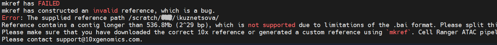

<!-- README.md is generated from README.Rmd. Please edit that file -->

## **scShardSplitRef**

is designed for researchers working with single-cell data from species
that require building a custom reference genome, particularly when one
or more contigs in the reference FASTA exceed the Cell Ranger limit of
536.8Mb (2^29 bases). *scShardSplitRef* automates this splitting
process, generating contig fragments that comply with *Cell Ranger*
requirements. The software outputs FASTA and GTF files containing the
split contigs, which can be directly processed by
`cellranger-arc mkref`.

## **Problem overview**

*Cell Ranger* provides pre-built reference genomes for common species
such as human and mouse. For less common species, users must build a
custom reference using `cellranger-arc mkref` for the multiome ATAC +
Gene Expression sequencing data. When working with species that have
very large chromosomes or scaffolds, users may encounter the following
error:  
\>*Due to limitations of the BAM index format, a contig in the reference
FASTA file cannot exceed *536.8Mb (2^29 bases)*. If a contig exceeds
that size you will have to split it into smaller contigs and make
corresponding modifications to the GTF file.* [Source: 10x Genomics
Documentation](https://www.10xgenomics.com/support/software/cell-ranger-arc/latest/analysis/inputs/mkref)

> <figure>
>  alt="screenshot of the error" />
> <figcaption aria-hidden="true">screenshot of the error</figcaption>
> </figure>

For example, in large genomes such as barley, several chromosomes
(*2H=665.59Mb, 3H=621.52Mb, 4H=610.33Mb, 5H=588.22Mb, 6H=561.79Mb,
7H=632.54Mb*) exceed this size threshold. These contigs cannot be
processed by `cellranger-arc mkref`. As a result, `cellranger-arc mkref`
cannot build a reference unless “oversized” chromosomes are divided into
smaller fragments.

## **Purpose of this tool**

`scShardSplitRef` enables researchers to build custom references for the
Multiome ATAC + Gene Expression sequencing data for large-genome species
without manual intervention.

- Tests for the special case of centromere locations overlapping with
  gene features and updates the centromere coordinates file  
- Splits contigs exceeding the 536.8Mb Cell Ranger ARC limit into valid
  fragments in FASTA  
- Adjusts the corresponding GTF entries accordingly  
- Produces a valid reference files ready for use with
  `cellranger-arc mkref`

## **Usage / Quick start**

##### Input requirements:

- A reference genome sequence (FASTA from ENSEMBL)  
- Gene annotations (GTF from ENSEMBL)  
- Centromere coordinates (BED file)

##### “HOW-TO” tutorials: [How to modify GTF using scShardSplitRef](vignettes/my-vignette.Rmd)

## **Example Workflow**

A toy example workflow walks through the [step-by-step using toy
files](example).

## **Installation**

`scShardSplitRef` developed in R (v.4.4.3), using dplyr(v.1.1.4),
stringr(v.1.5.1), utils(v.4.4.3) libraries.  
*\[remove tidyverse(v.2.0.0) after deploying r package\]*

## **Limitations / Notes**

Please note that this package has been developed for use with diploid
organisms. What the tool does not do.

- Does not validate biological correctness of annotations
- Does not merge or reorder GTF entries
- Does not handle circular genomes

## **Citation**

Please cite this tool if you use it Author’s list: Irina Kuznetsova,
Luke Pembleton, Pasquale Luca Curci, Adam Sparks  
Curtin University, Barenbrug, CNR Institute of Biosciences and
BioResources, Curtin University

## **License**

This project is licensed under the [GPL-3.0 license](LICENSE.md).

## **Contributing**

If you’d like to help improve this tool, please send your suggestions
via email.  
Please clearly outline the feature(s) you think should be added. As the
tool develops, new features can be added as separate package functions
and contributed back to the project.  
Remember that improving tools is important, but keeping them neat and
not over-complicated is just as essential.
