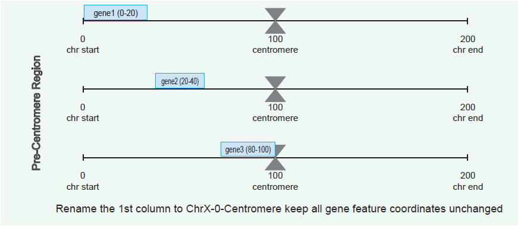
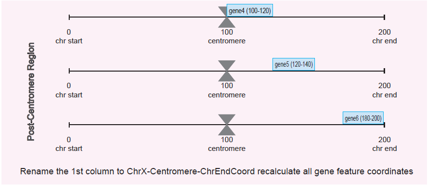
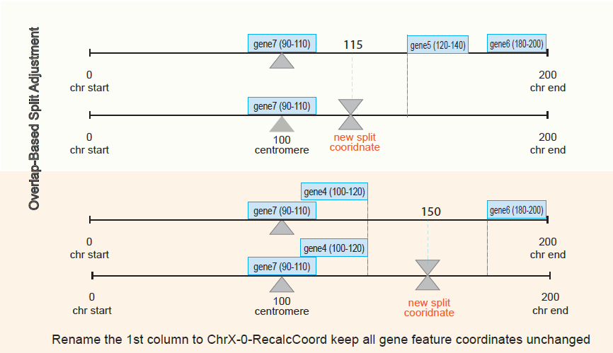
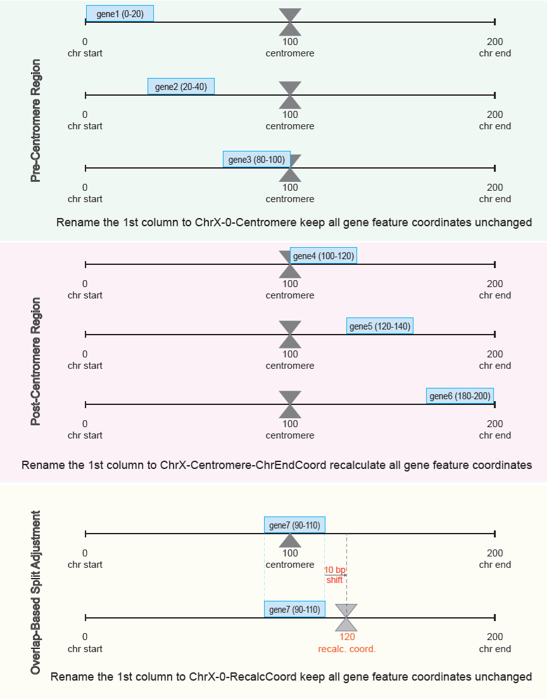

```{r, include = FALSE}
knitr::opts_chunk$set(
  collapse = TRUE,
  comment = "#>"
  )
devtools::load_all() #### delete after publishing
```

## 1. Purpose

This toy dataset provides a minimal example to demonstrate the logic of the algorithm that prepares reference files (GTF and FASTA) for `cellranger‑arc mkref`.
It allows users to test the workflow without needing large genome files and helps confirm that the proposed workflow is functioning correctly.
It also provides an example of how to use it.

## 2. {scShardSplitRef} guided walk through using a toy example

### Installation

```{r setup}
library("scShardSplitRef")
library("knitr") # used for a kable table later in the document
```

### Prerequisites

| Software | Version | Purpose             |
|----------|---------|---------------------|
| bedtools | ≥ 2.30  | BED file operations |

### Input files

| File | Format | Description | File Name |
|-----------------|-----------------|-------------------|-------------------|
| Gene annotations | GTF | Gene features and coordinates | extdata/A3_toy_all_scenarios_2chr.gtf |
| Centromere coordinates | BED-like | Centromere positions per chromosome (x) | extdata/A3_toy_centromeres.bed |
| Genome sequence | FASTA | Reference genome sequence | extdata/A3_toy.fasta |

<br>

<details>

<summary><b>What does a GTF file look like?`<`{=html}
`/b></summary>`{=html}

```{r}
# Gene annotations (GTF) file, a tab-delimited 9-columns file.

gtf_file <- system.file(
  "extdata/A3_toy_all_scenarios_2chr.gtf",
  package = "scShardSplitRef"
  )
gtf_df <- read.table(file = gtf_file, 
                     header = FALSE, 
                     sep = "\t"
                     )
kable(gtf_df[1:10, ])
```

</details>

<details>

<summary><b>What does a BED-like centromere file look like?`<`{=html}
`/b></summary>`{=html}

```{r}
# The format of the centromere coordinates file is a tab-delimited 3-column file, where the 1st column contains chromosome/contig names, the 2nd column contains the centromere coordinate, and the 3rd column contains chromosome/contig region end coordinates.
# Manually formatted centromere file (please check what it should look like below):
# data.dir = "/inst/extdata/02_MorexV3_centromere_coordinates.bed"

bed_file <- system.file(
  "extdata/02_MorexV3_centromere_coordinates.bed",
  package = "scShardSplitRef"
  )
centr_bed_df <- read.table(file = bed_file, 
                           header = FALSE, 
                           sep = "\t"
                           )
kable(centr_bed_df[1:10, ])
```

</details>

## Step-by-step Guide

We begin by assessing the formatting of the input GTF and BED files, followed by checking and, if necessary, modifying the split coordinates in the BED file.
The GTF file is then updated according to the split position.
Finally, the FASTA file is split and formatted for compatibility with Cell Ranger ARC.

### Step-1

The first function called `validate_inputs()`, checks the correct format of (FASTA and BED-like) input files.
The centromere coordinate file is manually created in BED-like format and should be tab-delimited.
All files need to be decompressed for use in Cell Ranger ARC.

#### The help page for the validate_inputs()

```{r, eval=FALSE}
?validate_inputs
```

#### Validate (FASTA and BED) input files

```{r}
bed_path <- system.file(
  "extdata/A3_toy_centromeres.bed",
  package = "scShardSplitRef"
  )
gtf_path <- system.file(
  "extdata/A3_toy_all_scenarios_2chr.gtf",
  package = "scShardSplitRef"
  )
# Validate input (FASTA and BED) files
input_verif <- validate_inputs(bed = bed_path, 
                               gtf = gtf_path
                               )
kable(input_verif$bed[1:5,])
kable(input_verif$gtf[1:5,])
```

> If GTF and BED formats are correct, a confirmation message will be printed to the console: *"All files loaded and validated successfully"*

### Step-2

The next step is to prepare split coordinates in appropriate BED-like format.
This function ensures that chromosomes are not split in the middle of a gene region.
To achieve this, we first check whether the centromere coordinates overlap with any gene features, and if they do, we shift the split position by a specified length in base pairs (bp).

### The help page for the determine_split_regions() function

```{r, eval=FALSE}
?determine_split_regions
```

<details>

<summary><b>Visual representation of gene‑feature locations in relation to the centromere on the chromosome</b></summary>

Visual representation of gene‑feature locations in relation to the centromere on the chromosome.
This visualisation shows various possibilities of genes being located on a chromosome.
To make it clear, we split the chromosome region into before the centromere location and after the centromere location.
A gene can be located at the beginning of the chromosome, between the beginning and the centromere position, and ending at the centromere coordinate.
The same locations apply after the centromere coordinates.
There are rare cases where a gene's coordinates overlap with the centromere coordinate.
If that is the case our tool re-calculates such positions by shifting them by a specified number of base pairs (bp).

In green: we see possible locations of genes from the beginning of the chromosome to the centromere location.
In this case the algotuhm renames the 1st column to ChrX-0-Centromere and keeps all gene feature coordinates unchanged 

In pink: we see possible locations of genes from the centromere location to the chromosome end.
In this case the algorithm renames the 1st column to ChrX-Centromere-ChrEndCoord and recalculates all gene feature coordinates 

In yellow: if the centromere overlaps with the gene, get its end coordinate (for e.g. gene7: 110) then look for the next to it gene and get the start coordinate of that gene (for e.g g5:120) and find middle point that will be a neww split coordinate (115).
Genes can also overlap (orange), in this case the end coordinate is the end coordinate of the overlapping gene and the start coordinate of the next gene (for e.g. gene6:180) 



Toy GTF file ("extdata/A3_toy_all_scenarios_2chr.gtf") content summary

| Gene     | Chr               | Start | End | Note                   |
|----------|-------------------|-------|-----|------------------------|
| gene1    | 1H                | 0     | 20  | before centromere      |
| gene2    | 1H                | 20    | 40  | before centromere      |
| gene3    | 1H                | 80    | 100 | ends at centromere     |
| gene7    | 1H                | 90    | 110 | overlaps centromere    |
| gene8    | 1H                | 90    | 112 | overlaps centromere    |
| gene4    | 1H                | 100   | 120 | starts at centromere   |
| gene5    | 1H                | 120   | 140 | after centromere       |
| gene6    | 1H                | 180   | 200 | ends at chromosome end |
| gene2H_2 | 2H                | 55    | 78  | before centromere      |
| gene2H_1 | 2H                | 140   | 160 | overlaps centromere    |
| gene2H_3 | 2H                | 260   | 275 | after centromere       |
| CONTIG1  | CAJHDD010000004.1 | 5     | 20  | contig                 |
| CONTIG2  | CAJHDD010000001.1 | 10    | 30  | contig                 |
| MT1      | Mt                | 2     | 10  | organelle              |
| PT1      | Pt                | 1     | 5   | organelle              |

</details>

### Build BED-like split intervals from genomic regions (BED) and gene annotations (GTF)

```{r}
# Define output directory
output_file <- file.path(tempdir(), 
                         "outdata"
                         )
dir.create(output_file, 
           recursive = TRUE, 
           showWarnings = FALSE
           )
output_file_name_dir <- file.path(output_file, 
                                  "A3_toy_split_regions.bed"
                                  )

# Determine split regions
get_split_reg <- determine_split_regions(
  bed = bed_path,
  gtf = gtf_path,
  output_bed = output_file_name_dir,
  limit = 2L^29L,
  shift_by = 20L
  )

get_split_reg
```

<details>

<summary><b>What does the generated BED file look like?`<`{=html}
`/b></summary>`{=html}

```{r}
bed_f <- system.file(
  "outdata/A3_toy_split_regions.bed",
  package = "scShardSplitRef"
)
split_region_bed_df <- read.table(file = bed_f, 
                                  header = FALSE, 
                                  sep = "\t"
                                  )
dim(split_region_bed_df)
split_region_bed_df
```

</details>

### Step-3

Generate a gene annotation (GTF) file in compatible to Cell Ranger ARC format.
The first column of the GTF file should be in the following form `Chr-RegionStart-RegionEnd`.
Note that the output file name is hardcoded and starts with "B1_FINAL_MODIFIED_GTF\_[*genome_name*]\_[*genome_version*].gtf".

#### The help page for the `process_gtf()` function

```{r, eval=FALSE}
?process_gtf
```

#### Generate gene annotation (GTF) file in compatible to Cell Ranger ARC format

```{r}
# Process GTF file and write file to tempdir()
process_gtf(
  split_regions_bed = output_file_name_dir,
  gtf = gtf_path,
  genome_name = "toy",
  genome_version = "noversion",
  out_path = tempdir()
  )
```

> The output file is in the GTF format.
> Note that the first column has been reformatted — the regions are now split.
> The chromosome name is formatted as `1H-0-206486643`, which is the region from the beginning of the chromosome to the split position; \``1H-206486643-516505932` is the region from the split position to the end of the chromosome.

<details>

<summary><b>What does the generated GTF file look like?`<`{=html}
`/b></summary>`{=html}

```{r}
gtf_f <- system.file(
  "outdata/B1_FINAL_MODIFIED_GTF_toy_noversion.gtf",
  package = "scShardSplitRef"
  )

processed_gtf <- read.table(file = gtf_f, 
                            header = FALSE, 
                            sep = "\t"
                            )
dim(processed_gtf)

sep <- as.data.frame(matrix("...", 
                            nrow = 1, 
                            ncol = 5)
                     )
colnames(sep) <- colnames(processed_gtf)[1:5]

kable(rbind(
  processed_gtf[10:23, 1:5],
  sep,
  processed_gtf[(nrow(processed_gtf) - 2):nrow(processed_gtf), 1:5]
  )
  )
```

</details>

### Step-4

Final steps is to split the FASTA file, where the header lines should have the same chrosomome annotations as the GTF file.

```{bash, eval=FALSE}
# Toy example
IN_FA="/inst/extdata/A3_toy.fasta"
BED_FIN_OUT="/inst/outdata/A3_toy_centromeres.bed"
FASTA_FIN_OUT="/inst/outdata/"

# Split FASTA
bedtools getfasta -fi ${IN_FA} -bed ${BED_FIN_OUT} -fo ${FASTA_FIN_OUT}/A3_toy_bedtools.fasta
```

<details>

<summary><b>What does the generated FASTA file look like?`<`{=html}
`/b></summary>`{=html}

```         
# outdata/A3_toy_bedtools.fasta

>1H:0-160
ATCGGCTAGCTAGCTAGCTAGCTAGCTAGCTAGCTAGCTAGCTAGCTAGCTAGCTAGCTAGCTAGCTAGCTAGCTAGCTAGCTAGCTAGCTAGCTAGCTAATCGGCTAGCTAGCTAGCTAGCTAGCTAGCTAGCTAGCTAGCTAGCTAGCTAGCTAGCTA
>1H:160-200
GCTAGCTAGCTAGCTAGCTAGCTAGCTAGCTAGCTAGCTA
>2H:0-180
GCTAGCTAGCTAGCTAGCTAGCTAGCTAGCTAGCTAGCTAGCTAGCTAGCTAGCTAGCTAGCTAGCTAGCTAGCTAGCTAGCTAGCTAGCTAGCTAGCTAGCTAGCTAGCTAGCTAGCTAGCTAGCTAGCTAGCTAGCTAGCTAGCTAGCTAGCTAGCTAGCTAGCTAGCTAGCTAGCTA
>2H:180-300
GCTAGCTAGCTAGCTAGCATCGGCTAGCTAGCTAGCTAGCTAGCTAGCTAGCTAGCTAGCTAGCTAGCTAGCTAGCTAGCTAGCTAGCTAGCTAGCTAGCTAGCTAGCTAGCTAGCTAGC
>CAJHDD010000004.1:0-50
ATCGGCTAGCTAGCTAGCTAGCTAGCTAGCTAGCTAGCTAGCTAGCTAGC
>CAJHDD010000001.1:0-40
GCTAGCTAGCTAGCTAGCTAGCTAGCTAGCTAGCTAGCTA
>Mt:0-20
ATCGGCTAGCTAGCTAGCTA
>Pt:0-10
ATCGGCTAGC
```

</details>

### Output Files

Output files to be used with Cell Ranger ARC.

| File | Format | Description | File Name |
|-----------------|-----------------|-------------------|-------------------|
| Gene annotations | GTF | Gene features and coordinates | outdata/B1_FINAL_MODIFIED_GTF_toy_noversion.gtf |
| Genome sequence | FASTA | Reference genome sequence | outdata/A3_toy_bedtools.fasta |

## 3. Session Info

```{r session-info}
sessionInfo()
```

## 4. Acknowledgements

This work was supported by resources provided by the Pawsey Supercomputing Research Centres Nimbus Research Cloud (<https://doi.org/10.48569/v0j3-qd51>), with funding from the Australian Government and the Government of Western Australia.
